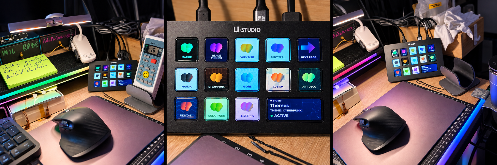
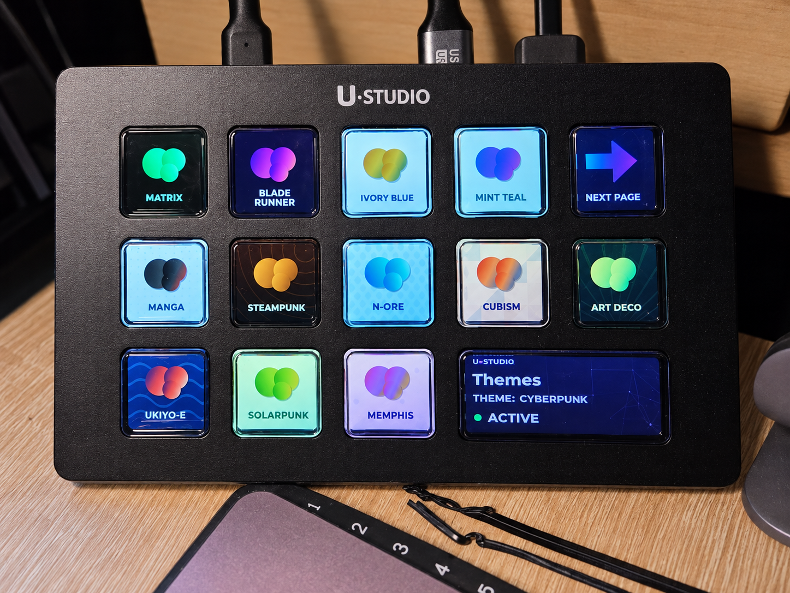
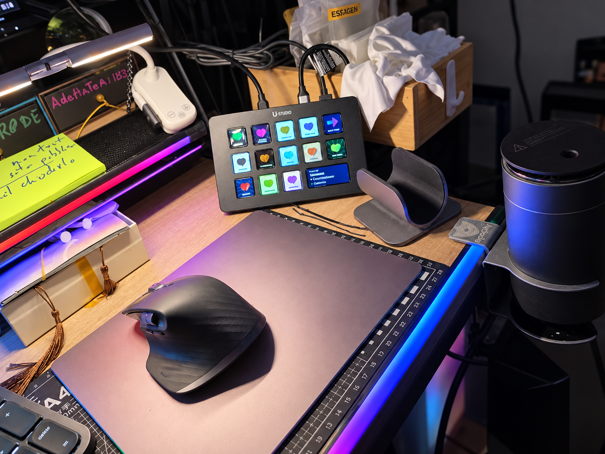
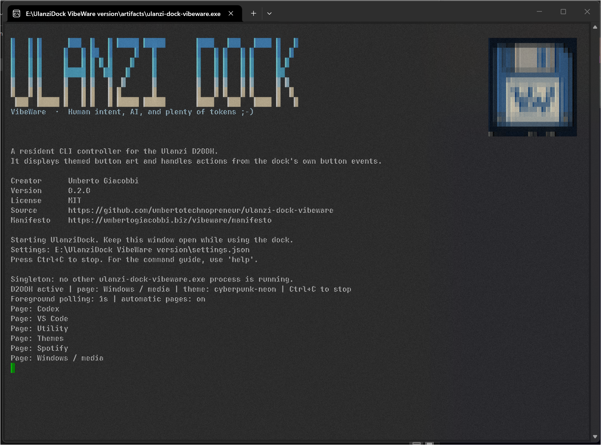
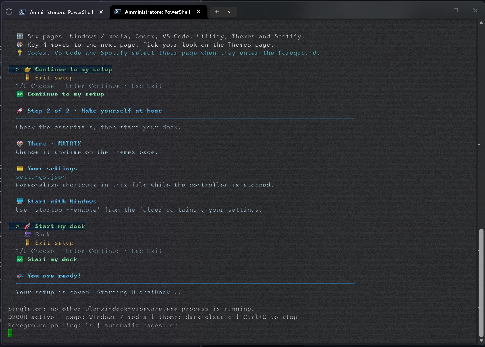

<!-- VBWR B
Project: UlanziDock VibeWare version
Repository: https://github.com/umbertotechnopreneur/ulanzi-dock-vibeware
Creator: Umberto Giacobbi | https://umbertogiacobbi.biz
VibeWare is Human intent. AI implementation. Accountable human review.
Manifesto: https://umbertogiacobbi.biz/vibeware/manifesto
AI Tooling: May include OpenAI Codex, GitHub Copilot and AI-assisted CI/CD pipelines.
AI Versions: Tools and models may vary by contributor and execution environment.
AI Traceability: Refer to Git history and CI/CD logs for recorded provenance.
Copyright (c) 2026 Umberto Giacobbi
SPDX-License-Identifier: MIT
License: MIT - see LICENSE
Required by the MIT License: retain the copyright and permission notice in all copies or substantial portions of the Software.
VBWR E -->

# UlanziDock VibeWare version

## Why I built it

Imagine a little box of magic buttons on your desk. Press one: the music pauses. Press another: your favourite shortcut happens. I wanted to choose the pictures and tell each button what to do. Simple, right?

I bought a **Ulanzi D200H**, then discovered that changing a few tiny pictures seemed to need almost **800 MB** of vendor software. That is a rather large moving truck for a handful of buttons. I wanted a small controller that did the job and let me get on with my day, so I built one in Rust.

I am [Umberto Giacobbi](https://umbertogiacobbi.biz), and this is my MIT-licensed controller, made as part of VibeWare. Bring your dock, pick a theme, and make the buttons yours.



*My actual desk and dock, with a little AI help for the panoramic picture.*

## Download

The first stable public package is **0.1.0**, tagged **v0.1.0-stable**. Older `v0.1.0`, `v0.2.0`, and `v0.3.0` tags remain historical previews; their numbers do not describe this stable package. Get the matching archive from [GitHub Releases](https://github.com/umbertotechnopreneur/ulanzi-dock-vibeware/releases):

| Your computer | Package |
| --- | --- |
| Windows, Intel or AMD | `ulanzi-dock-vibeware-v0.1.0-stable-windows-x64.zip` |
| Windows on ARM | `ulanzi-dock-vibeware-v0.1.0-stable-windows-arm64.zip` |
| Linux x64 | `ulanzi-dock-vibeware-v0.1.0-stable-linux-x64.tar.gz` |
| macOS, Intel | `ulanzi-dock-vibeware-v0.1.0-stable-macos-x64.tar.gz` |
| macOS, Apple Silicon | `ulanzi-dock-vibeware-v0.1.0-stable-macos-arm64.tar.gz` |

Extract the whole archive into a writable folder. Windows users can double-click `ulanzi-dock-vibeware.exe`; keep `ulanzi-dock-launcher.exe` beside it for optional sign-in startup. On Linux or macOS, open a terminal in the extracted folder and run `./ulanzi-dock-vibeware run`.

The archives include documentation and license notices. Windows binaries are unsigned; macOS binaries are not signed or notarized. Linux needs a desktop session, the system libraries described in [release notes](docs/RELEASING.md), and permission to access the dock's HID interfaces. The Windows tray, foreground application detection, and sign-in launcher are Windows features. macOS and Linux builds do not establish that the dock has been physically tested on those systems.

## My setup

I photographed the controller on my own desk. The banner combines three views; the two larger views below show more detail. They are AI-enhanced from the real photos, so I use the unaltered terminal screenshots below for exact software text and behavior.

<table>
  <tr>
    <td width="50%"></td>
    <td width="50%"></td>
  </tr>
</table>

## What it does

I use the operating system's HID access to display themed button artwork, listen to the dock's button events, and run the shortcuts I configure. The current source has nine pages: **Windows / media, Utility, Codex, VS Code, Spotify, Word, PowerPoint, Excel and Themes**, with thirteen visual themes. Existing settings gain missing Office pages and are reordered in memory by page name, retaining custom keys and actions. [Take a look at the themes in the PDF guide](docs/ulanzi-dock-vibeware-guide-v2.pdf); that earlier catalogue predates this page order and the Office pages.

On Windows, **Detect applications** checks the foreground process and marks application pages unavailable when their app loses focus; **NEXT PAGE** still works. With detection enabled, I can separately enable **Switch page automatically**: switching between Codex, VS Code, Spotify, Word, PowerPoint and Excel selects their page, and switching to another known application returns to Windows / media. Windows / media and Utility are general-purpose pages. Turning detection off keeps every enabled page usable, removes inactive overlays, and stops foreground polling and automatic page switching. With detection on and automatic switching off, page navigation remains manual while availability checks continue.

Each Office application has its own native command icons in every theme: Word adds text formatting and spelling; PowerPoint adds slide creation, duplication and slideshow controls; Excel adds AutoSum, cell formatting, dates, editing and filters. Process matching uses `WINWORD.EXE`, `POWERPNT.EXE` and `EXCEL.EXE`. Default shortcuts target desktop Office on Windows with a US English keyboard layout; adapt them to your Office language and layout in `settings.json` or `applications.yaml`. See the [Office command list and shortcut references](docs/ARTWORK.md).

It does not install a custom driver or require Ulanzi Studio, OpenDeck, or WSL. It runs without an installer. The desktop dialogs use Slint with Winit and its software renderer; no WebView or JavaScript runtime is required.

## Get started

The guided welcome below is included in the **0.1.0 stable source**. Historical preview packages may behave differently.

For a build with the guided welcome, put the executable in a writable folder, connect the D200H, and run:

```powershell
.\ulanzi-dock-vibeware.exe run
```

On the first run, I show two short screens: **Meet your dock** explains the buttons and pages; **Make yourself at home** shows the selected theme and `settings.json`. Choose **Start my dock**. On Windows, the running controller adds the UlanziDock icon to the system tray; an Explorer launch closes its private console after setup. A controller started from an existing terminal keeps that terminal available, including Ctrl+C to stop it. The setup saves your settings when you continue. You can change the theme on the dock, edit shortcuts in `settings.json` while the controller is stopped, or reopen the welcome with `run --oobe`.

For automatic launch at Windows sign-in, keep `ulanzi-dock-launcher.exe` beside the controller and run `ulanzi-dock-vibeware.exe startup --enable` from the folder containing your `settings.json`. This creates a per-user Startup shortcut, replacing the old owned `.cmd` launcher after backing it up outside Startup. The small native Windows launcher starts the controller with `CREATE_NO_WINDOW` and `run --background --config <absolute path> --status-display`; it opens no console and runs no script at sign-in. Background mode skips console onboarding without changing settings. Windows PowerShell is used only when registering or removing the shortcut. Use `startup` to inspect the registration and `startup --disable` to remove it. Re-run `startup --enable` after moving the executable or settings folder.

The Windows tray is installed before HID discovery or display initialization. If the dock is missing or not yet ready at sign-in, the app retries its initial connection every two seconds while About, Open CLI, Restart and Exit remain available. A bounded `--seconds` run includes this waiting time. Explorer tray registration also retries for up to thirty seconds while the notification area starts. These retries cover initial connection; a USB error during an established controller session still ends that session.

Right-click the Windows tray icon for:

- **Open CLI:** open an interactive Command Prompt in the executable's folder. This opens a shell without starting another controller.
- **Restart:** stop the current controller, remove its tray icon, and relaunch the same executable with its working directory and run options. The new process waits for the old one to exit before opening HID. The one-time `--oobe` flag is omitted because setup has already completed.
- **GitHub:** open the [project repository](https://github.com/umbertotechnopreneur/ulanzi-dock-vibeware) in the default browser.
- **VibeWare manifesto:** open the [VibeWare manifesto](https://umbertogiacobbi.biz/vibeware/manifesto) in the default browser.
- **About:** open a Slint dialog with the product logo, version, creator, GitHub/manifesto links, and a **Configure** button. Its bottom panel says **This is VibeWare**, with the original floppy, motto and **What is VibeWare?** link. Closing either Slint window keeps the resident controller running.
- **Exit:** stop the controller and remove its tray icon without a terminal key prompt.

A left click shows only a native Windows message directing you to right-click the icon and choose About. The Slint windows remain hidden at controller startup. [Windows may initially put the icon in the tray's overflow area](https://learn.microsoft.com/en-us/windows/win32/shell/notification-area). The native tray is Windows-only; the standalone Slint dialogs have portable source for Windows, Linux, and macOS. Other platforms retain the console controller.

The configuration **MainWindow** offers all thirteen themes, application detection, optional automatic page switching, and the foreground polling interval (1–60 seconds). **Save** writes settings for the next launch; **Save + Restart** also restarts the resident controller. Explicit run flags such as `--theme`, `--no-app-detection`, `--no-auto-page`, and `--focus-poll-seconds` continue to take precedence. Buttons open `settings.json` and `applications.yaml` in an editor for shortcut and application mapping changes. Saving updates the theme, adds missing pages, persists their order, and patches YAML runtime fields (`detect_applications`, `auto_switch`, `focus_poll_seconds`), retaining existing page objects, custom actions, YAML comments, and existing line endings. Changed files get adjacent `.gui.bak` backups and staged replacements; if another editor or the dock changes settings while the dialog is open, reload before saving. Inline YAML runtime maps can be edited manually.

The **Application pages** checkboxes independently enable or disable Codex, VS Code, Spotify, Word, PowerPoint and Excel (and custom pages with executable mappings). Disabled pages are skipped by NEXT PAGE and automatic switching, even when detection is off. Disabling a page saves its `enabled` flag in JSON and retains all its shortcuts. Windows / media, Utility and Themes stay available in the configurator. Changes apply on restart.

To open either dialog without connecting to HID or replacing the resident instance:

```powershell
.\ulanzi-dock-vibeware.exe about --gui
.\ulanzi-dock-vibeware.exe configure
```

Both commands accept `--config <path>`; without it they use the Explorer-launch settings location. The existing `about` and `--about` commands still print to the terminal.

The locked source dependencies require Rust 1.90 or newer. For a local Windows build, use `pwsh -NoProfile -File scripts/build-local.ps1`. To stop this workspace's running controller before compiling and replacing `artifacts/ulanzi-dock-vibeware.exe`, pass `-StopRunning`. The script checks each live executable path, waits for it to stop, and preserves settings and source files. Add `-KeepBuildCache` to retain the ignored `tmp/local-build` dependency cache between builds; otherwise temporary build data is removed.

<table>
  <tr>
    <th>Controller running</th>
    <th>First-run setup</th>
  </tr>
  <tr>
    <td width="50%"></td>
    <td width="50%"></td>
  </tr>
</table>

These are unaltered local Windows screenshots. The first is from an earlier **0.2.0** run, so its on-screen version and motto predate the current release; the second shows the guided setup. Your theme and configuration may differ. For commands and options, use `ulanzi-dock-vibeware help`.

## What I have checked

I have tested the D200H's button events, clock, page navigation, and a subset of artwork on **Windows x64 hardware**. I have also observed the optional wide status panel on that device. The new Slint dialogs and isolated configuration saves have been checked on Windows x64; the new Office pages and automatic switching have not been physically checked on the dock. The earlier Windows ARM64 build has not been physically tested on ARM64 hardware; the Slint changes have only been built for Windows x64. Linux and macOS device behavior has not been physically validated. Offline artwork previews do not establish what the dock displays.

## Source and credits

I wrote this MIT implementation from observed protocol behavior. I used [OpenActionMirrors D200](https://github.com/OpenActionMirrors/com.glmagalhaes.ulanzi.d200) and [independent D200 protocol research](https://github.com/marcelobrake/ulanzi-linux/blob/main/docs/protocol.md) as references; I did not copy AGPL source code. Artwork and font provenance are in [ARTWORK.md](docs/ARTWORK.md). Slint is used under its royalty-free desktop application license with the standard AboutSlint attribution widget; see [third-party notices](docs/THIRD-PARTY.md). The alternate light [banner illustration](assets/banners/ulanzi-dock-light.png) is a concept, not a device photograph.

Copyright © 2026 Umberto Giacobbi. MIT licensed; see [LICENSE](LICENSE).

---

<a href="https://umbertogiacobbi.biz/vibeware/manifesto">
  
</a>

### This is VibeWare

VibeWare is a term coined by [Umberto Giacobbi](https://umbertogiacobbi.biz) and an open initiative for developers who build with AI and care about the craft. It challenges the assumption that vibe coding is synonymous with low-quality code. It openly acknowledges the weaknesses and risks of AI-generated software: experienced developers must guide the process, test carefully, check security and take responsibility for the result. A VibeWare footer simply says: this software was developed with AI, and it deserves to be judged by the quality of the work.

[Read the VibeWare manifesto](https://umbertogiacobbi.biz/vibeware/manifesto)

*You are welcome to explore, adapt and reuse the open-source VibeWare materials under the project license — my contribution to the developer community.*
